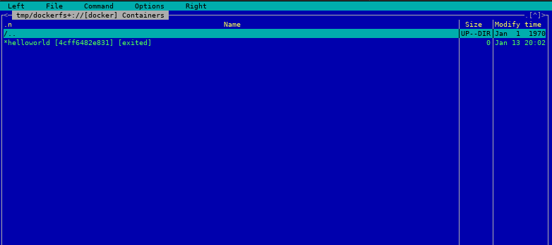
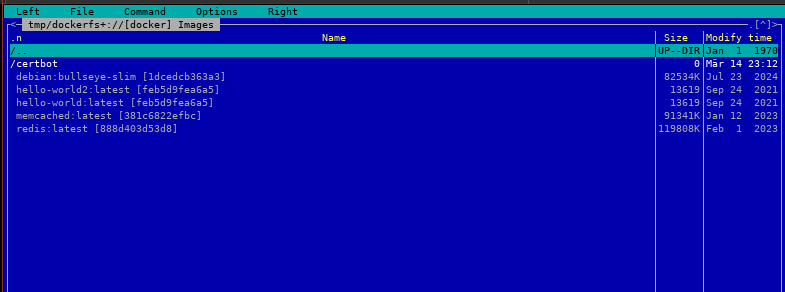
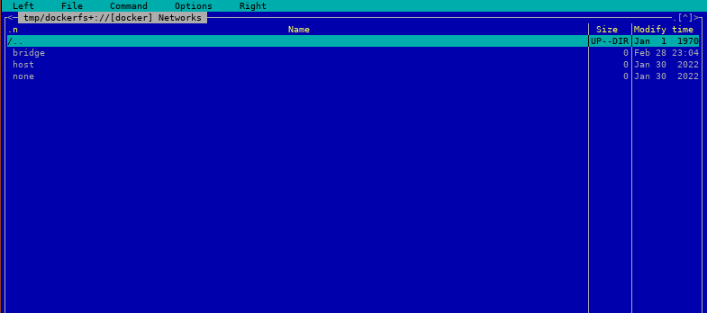
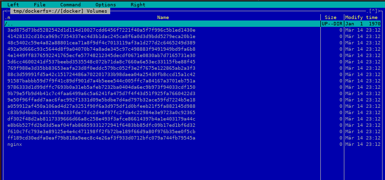

# Docker Virtual filesystem for Midnight Commander

A virtual filesystem for Midnight Commander to access and manage Docker containers, images, networks and volumes.

## Features

  * List Docker containers, images, networks and volumes
  * View Docker containers, images, networks and volumes
  * Easily delete supported Docker resources
  * Start a shell into running containers

## Installation

Copy `dockerfs+` to

    ~/.local/share/mc/extfs.d

and make it executable.

## Usage

    $ mc dockerfs://

If the Docker daemon is available via network, start it as:

    DOCKER_HOST=127.0.0.1:2375 mc dockerfs://

## ChangeLog

### 1.0 / 2025-03-16

    * Initial release

## Contributing

Found a bug or got a feature request? Please report it at
https://github.com/eht16/mc_extfs_docker/issues.

## License

Licensed under the MIT License.

## Author

Enrico Tröger <enrico.troeger@uvena.de>
